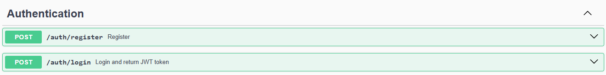
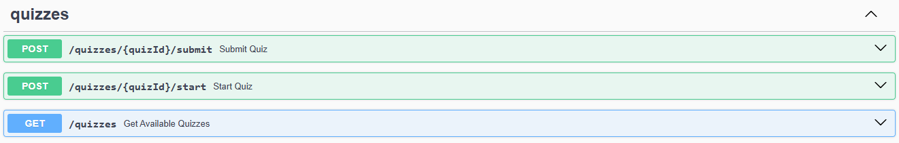
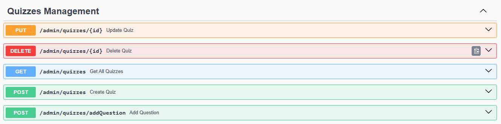

# Quiz Platform
A Spring Boot-based backend system for creating, managing, and taking quizzes with role-based access, scoring functionality.

## Features
<ul>
  <li>User Authentication & Authorization</li>
  <li>Role-based access</li>
        - Admin: Manage quizzes & questions
   
        - Participant(USER): Take quizzes and view results
  <li>Quiz & Question CRUD</li>
  <li>Timed quizzes</li>
  <li>Score calculation & submission</li>
  <li>Quiz leaderboard</li>
  <li>Clean RESTful APIs</li>
</ul>

## Tech Stack
<ul>
  <li>Java 17</li>
  <li>Spring Boot</li>
  <li>Spring Security + JWT</li>
  <li>JPA + Hibernate</li>
  <li>PostgreSQL</li>
  <li>Lombok</li>
</ul>

## Core API
### Authentication

### Quizzes

### Quizzes Management

